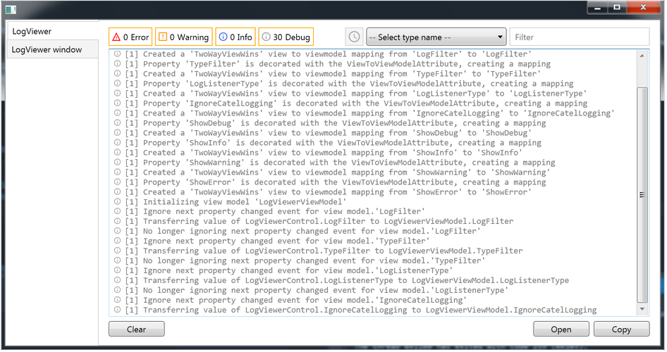
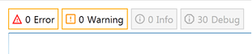
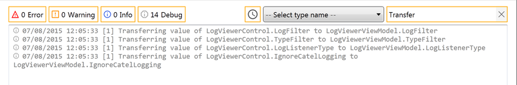
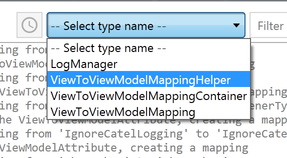
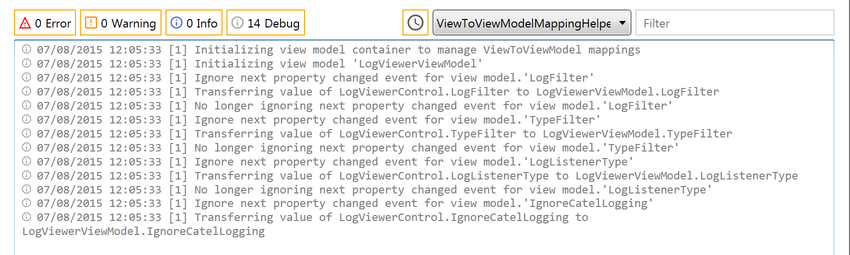
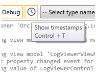

# Orc.LogViewer

[](https://gitter.im/WildGums/Orc.LogViewer?utm_source=badge&utm_medium=badge&utm_campaign=pr-badge&utm_content=badge)


An advanced log viewer for WPF applications.

Run the demo project to see the control in action:



Use level toggle buttons to show/hide log records:



Start typing in filter box to filter log records:  



Select a type name in combobox to filter log records by type name:





Use Time stamp toggle button to show/hide timestamps:



### How to use LogViewer

Here are the main properties, which are used to configure the LogViewer control:

Filtering: 

- **Level** => The log records types which will be shown.
- **LogListenerType** => Type. The log listener type. 
- **IgnoreCatelLogging** => boolean. Ignore Catel logging if true.

Visualisation:

- **ShowFilterBox** => boolean. Show Filter box if true.
- **ShowTypeNames** => boolean. Show Type names combobox if true.
- **AccentColorBrush** => Brush. The accent color.

```
<orc:AdvancedLogViewerControl AccentColorBrush="Orange" />
```

